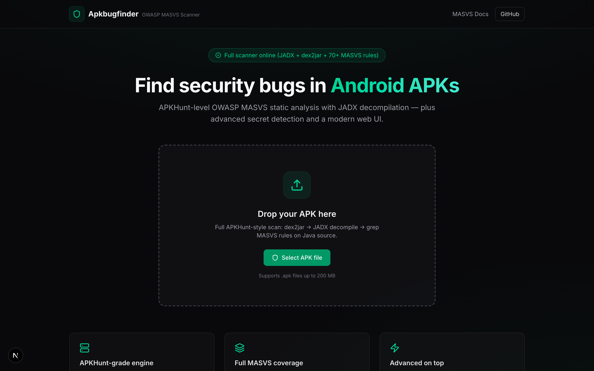
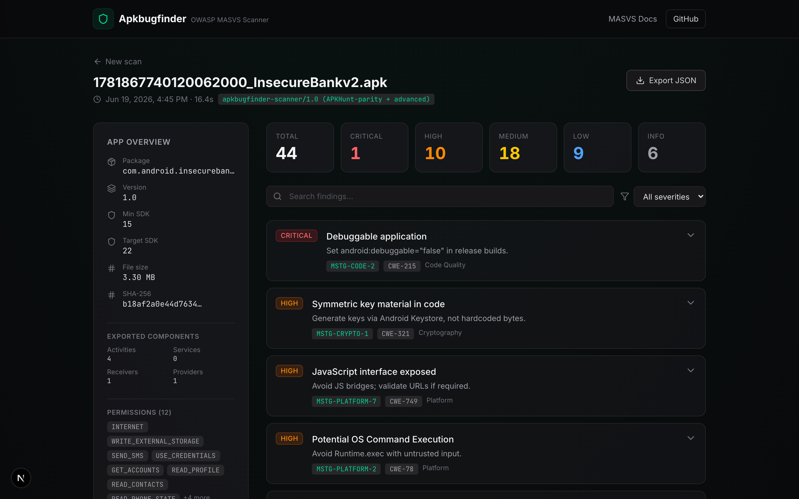
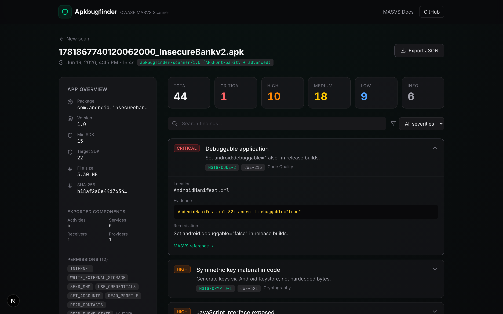
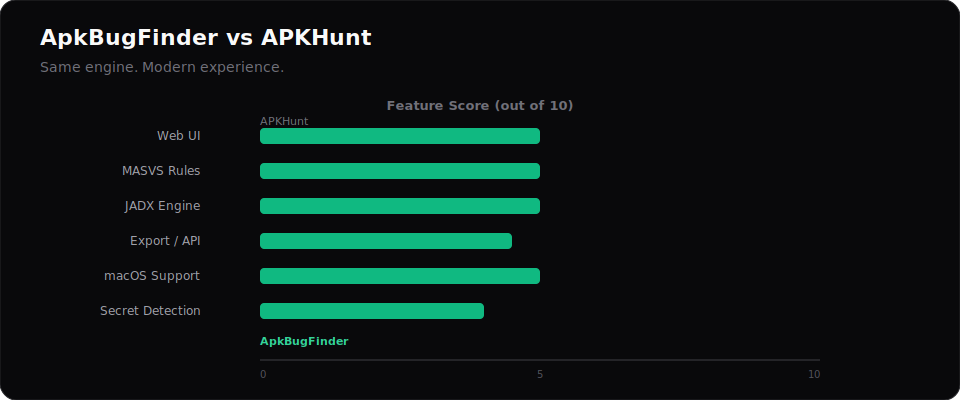

<div align="center">


# ApkBugFinder

### Drop an APK. Get a security report in seconds.

**The modern OWASP MASVS scanner for Android — built for developers, pentesters, and security teams who want answers, not a wall of terminal text.**

<br />

[](https://github.com/alexbieber/ApkBugFinder/stargazers)
[](LICENSE)
[](https://mobile-security.gitbook.io/masvs/)
[](https://nextjs.org/)
[](https://go.dev/)

<br />

[Live Demo](#-see-it-in-action) · [Features](#-why-apkbugfinder) · [Deploy](#-deploy-in-minutes) · [API](#-api) · [Contribute](#-contribute)

</div>

---

## The problem

Your Android app ships Friday. Security review is due Thursday. You don't have MobSF running, your pentester is booked, and **[APKHunt](https://github.com/Cyber-Buddy/APKHunt)** gives you a 3,000-line terminal dump nobody wants to read.

**You need to know:**
- Is the app debuggable in production?
- Are API keys hardcoded in the source?
- Is cleartext traffic allowed?
- Are WebViews exposing JavaScript bridges?
- Which exported components are attack surface?

**You need answers in minutes — not days.**

---

## The solution

**ApkBugFinder** combines the proven APKHunt analysis engine (JADX + dex2jar + MASVS grep rules) with a **beautiful web dashboard** your whole team can actually use.

> Upload an APK → get a prioritized findings report mapped to **OWASP MASVS**, **CWE**, severity, evidence snippets, and remediation guidance.

No Linux-only CLI. No unreadable logs. No guesswork.

---

## See it in action

### Homepage — drag, drop, scan

<p align="center">
  
</p>

<p align="center"><em>Clean upload interface with live scanner health indicator — full JADX engine or client fallback.</em></p>

### Findings dashboard — severity at a glance

<p align="center">
  
</p>

<p align="center"><em>Real scan of OWASP InsecureBankv2 — 44 findings categorized Critical → Info with MASVS mapping.</em></p>

### Finding detail — evidence + remediation

<p align="center">
  
</p>

<p align="center"><em>Every finding includes file location, code evidence, CWE reference, and one-click MASVS docs.</em></p>

---

## By the numbers

Real scan results from **[InsecureBankv2](https://github.com/dineshshetty/Android-InsecureBankv2)** (OWASP training APK):

<p align="center">
  
</p>

<table align="center">
<tr>
<td align="center"><b>~16s</b><br/>Scan time</td>
<td align="center"><b>44</b><br/>Total findings</td>
<td align="center"><b>70+</b><br/>MASVS rules</td>
<td align="center"><b>1</b><br/>Critical issue</td>
<td align="center"><b>10</b><br/>High severity</td>
</tr>
</table>

### MASVS category breakdown

<p align="center">
  
</p>

---

## How it works

<p align="center">
  
</p>

```
   📱  Upload APK  →  ⚙️  dex2jar + JADX  →  🔍  70+ MASVS Rules  →  📊  Actionable Report
```

---

## Why ApkBugFinder?

<table>
<tr>
<td width="50%">

### What you're leaving behind

- ❌ Terminal-only output
- ❌ Linux-only tooling
- ❌ Plain `.txt` reports
- ❌ No severity prioritization
- ❌ Manual grep through decompiled code
- ❌ One APK at a time, no history

</td>
<td width="50%">

### What you get with ApkBugFinder

- ✅ **Stunning web UI** — drag, drop, done
- ✅ **macOS + Linux + Docker** — works everywhere
- ✅ **JSON export** + scan history
- ✅ **Critical → Info** severity dashboard
- ✅ **70+ automated MASVS rules** on decompiled Java
- ✅ **Batch-ready** CLI + HTTP API

</td>
</tr>
</table>

### ApkBugFinder vs APKHunt

<p align="center">
  
</p>

| | [APKHunt](https://github.com/Cyber-Buddy/APKHunt) | **ApkBugFinder** |
|---|:---:|:---:|
| Web UI | ❌ | ✅ |
| Interactive dashboard | ❌ | ✅ |
| Severity prioritization | ❌ | ✅ |
| JSON / export | ❌ | ✅ |
| macOS support | ❌ | ✅ |
| HTTP API | ❌ | ✅ |
| Docker one-liner | ❌ | ✅ |
| JADX + dex2jar engine | ✅ | ✅ |
| 70+ MASVS rules | ✅ | ✅ |
| Advanced secret detection | ❌ | ✅ |
| Vercel-ready frontend | ❌ | ✅ |

**APKHunt proved the engine works. ApkBugFinder makes it usable.**

---

## Who is this for?

| Audience | How ApkBugFinder helps |
|----------|------------------------|
| **Android Developers** | Catch debuggable builds, hardcoded secrets, and weak crypto *before* release |
| **Security Engineers** | Standardize MASVS coverage across every app in your portfolio |
| **Penetration Testers** | Kick off engagements with instant SAST — focus manual testing on what matters |
| **Startups & Agencies** | Ship client apps with a security report you can attach to a deliverable |
| **Bug Bounty Hunters** | Quickly map attack surface: exports, WebViews, intents, network config |

---

## Features

### Core scanning
- **Full APKHunt parity** — JADX + dex2jar + grep on decompiled `.java` and `resources/*.xml`
- **70+ OWASP MASVS checks** — MSTG-STORAGE, CRYPTO, NETWORK, PLATFORM, CODE, RESILIENCE
- **Manifest intelligence** — permissions, exported components, backup/debug flags
- **Evidence with line numbers** — see exactly where the issue lives in decompiled source

### Advanced detection (beyond APKHunt)
- **Cloud & API secrets** — AWS keys, Google API keys, Stripe live keys, JWT tokens
- **Weak cryptography** — AES/ECB, MD5, static IVs, insecure random
- **WebView attack surface** — JS bridges, file access, SSL error handlers
- **Injection sinks** — SQLi, XSS, OS command execution patterns

### Dashboard & workflow
- **Severity-filtered findings** — Critical / High / Medium / Low / Info at a glance
- **MASVS + CWE mapping** — every finding linked to industry standards
- **One-click JSON export** — plug into CI, ticketing, or compliance workflows
- **Scan history** — compare runs without re-uploading

---

## Quick start

### Option A — Docker (recommended)

```bash
git clone https://github.com/alexbieber/ApkBugFinder.git
cd ApkBugFinder
docker compose up --build
```

| Service | URL |
|---------|-----|
| Web UI | http://localhost:3000 |
| Scanner API | http://localhost:8080/api/v1/health |

### Option B — Local dev

```bash
brew install go jadx dex2jar   # macOS
make scanner                   # Terminal 1 — Go API on :8080
npm install && npm run dev     # Terminal 2 — UI on :3000
```

### Option C — CLI (headless / CI)

```bash
cd scanner
go run ./cmd/apkbugfinder -p /path/to/app.apk
```

---

## Deploy in minutes

### Web UI → [Vercel](https://vercel.com)

1. Import [alexbieber/ApkBugFinder](https://github.com/alexbieber/ApkBugFinder)
2. Deploy — zero config for the frontend
3. Set `SCANNER_API_URL` → your scanner host (Railway / Fly.io)

### Scanner → Railway / Fly.io / Docker

```bash
docker build -f docker/Dockerfile.scanner -t apkbugfinder-scanner .
docker run -p 8080:8080 apkbugfinder-scanner
```

---

## MASVS coverage

ApkBugFinder maps findings to the [OWASP Mobile Application Security Verification Standard](https://mobile-security.gitbook.io/masvs/):

| Category | Examples |
|----------|----------|
| **V2 — Storage** | SharedPreferences, SQLite, Firebase, logs, clipboard, hardcoded secrets |
| **V3 — Crypto** | Weak algorithms, static IVs, insecure random, hardcoded keys |
| **V4 — Auth** | Cookie handling, biometric implementation |
| **V5 — Network** | MITM risks, cleartext traffic, cert pinning, hostname verification |
| **V6 — Platform** | SQLi, XSS, WebView, implicit intents, exported components |
| **V7 — Code Quality** | Debuggable flag, StrictMode, obfuscation |
| **V8 — Resilience** | Root/debug/emulator detection, SafetyNet |

---

## API

| Endpoint | Method | Description |
|----------|--------|-------------|
| `/api/v1/health` | `GET` | Scanner status + dependency check |
| `/api/v1/scan` | `POST` | Upload APK (`multipart/form-data`, field: `apk`) |

```bash
curl -X POST -F "apk=@app-release.apk" http://localhost:8080/api/v1/scan
```

---

## Project structure

```
ApkBugFinder/
├── docs/
│   ├── assets/          # Charts, banners, diagrams
│   └── screenshots/     # UI screenshots
├── src/                 # Next.js web UI
├── scanner/             # Go engine (JADX + MASVS rules)
└── docker/              # Production Dockerfiles
```

---

## Roadmap

- [ ] HTML / PDF report export
- [ ] SARIF output for GitHub Advanced Security
- [ ] CI/CD GitHub Action
- [ ] APK version diff — new vs fixed findings
- [ ] Custom YAML rule plugins

---

## Contribute

1. **Star the repo** — helps others discover ApkBugFinder
2. **Report bugs** — [GitHub Issues](https://github.com/alexbieber/ApkBugFinder/issues)
3. **Add MASVS rules** — edit `scanner/internal/rules/rules.go`
4. **Refresh screenshots** — `npm run screenshots`

---

## License

MIT — free for personal and commercial use.

---

## Disclaimer

ApkBugFinder is for **legitimate security testing only**. Scan apps you own or have permission to analyze.

---

<div align="center">

**If ApkBugFinder saved you hours on a security review, give it a star.**

[](https://github.com/alexbieber/ApkBugFinder/stargazers)

Built with care for the Android security community.

[⬆ Back to top](#apkbugfinder)

</div>
